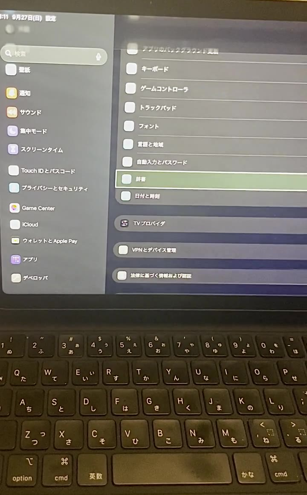

English | [日本語](README.ja.md)

# iOS Device Control using CoreDevice

*Technical Report and Reference Implementation*

This is a technical report and reference implementation that connects to an iPad over the network from a Windows PC and performs screen capture, Accessibility retrieval, app launching, taps, swipes, button presses, and text entry. The initial setup connects the iPad and the Windows PC by USB, but once RemotePairing has been created, the iPad can be controlled without a USB cable as long as an IP path exists between the two.

The verified workflow does not require a Mac or Xcode. Windows 11 is the tested host environment, but the control architecture itself is not Windows-specific: it combines RemotePairing, a userspace RSD tunnel, Accessibility observation, and CoreDevice services into a reproducible device-control workflow.

The control path does not use WebDriverAgent, XCTest, or Appium; it uses RemotePairing, a userspace tunnel, RSD, DDI, and CoreDevice HID / AppService. This setup shares a single connection and control foundation and splits only the method used to locate the target of an operation into Vision observation and Semantic observation.

This document records the configuration that has been verified to work, the reproduction steps, and known limitations.

~~~text
User or AI agent
              │
              ▼
ipad-control CLI on Windows
              │
 RemotePairing → userspace tunnel → RSD → DDI
              │
       ┌──────┴──────────────────┐
       │                         │
 Vision observation        Semantic observation
 Screen PNG, coordinates   Accessibility labels
       │                         │
       └──────────┬──────────────┘
                  ▼
        CoreDevice HID / AppService
        tap / swipe / button
        text entry / app launch
                  │
                  ▼
                 iPad
~~~

Vision observation can obtain the spatial layout of the screen. Semantic observation does not use a vision model and can obtain the front app's menu items and selection states as short text. Because the two have different limitations, they are switched according to the use case.

## Demo

A short physical-device recording showing the focus highlight advancing through Settings items while Accessibility elements are enumerated. Click the image to play the video.

## 1. Verified configuration

With the following configuration, screen capture, Accessibility element enumeration, launching the Settings app, HID taps, swipes, the Home button, and text entry have been verified.

| Item | Configuration |
|---|---|
| PC | Windows 11 |
| iPad | iPad Air (M4) |
| iPadOS | 27.0 |
| Python | 3.10.4 x64 |
| Device communication | pymobiledevice3 11.15.4 |
| TLS support | sslpsk-pmd3 1.0.3 |
| Image processing | Pillow 12.3.0 |
| Pairing app on the iPad | StikPair |
| IPA installation | Sideloadly 0.60 |
| Network path | An IP network that can reach TCP 49152 on the iPad |
| Reference implementation | ipad-hybrid-control 0.3.2 |

This table records the exact combination that was verified. It is not a claim that these are the only compatible device, OS, or tool choices.

> [!NOTE]
> Windows 11 is the environment in which this configuration was verified. This document does not assert that the mechanism described is specific to Windows. The scripts bundled with this release (setup.ps1, run.ps1, check.ps1) are currently PowerShell-based.

> [!NOTE]
> RemotePairing on the iPad using StikPair assumes iPadOS 27 or later. Even if an older iPadOS supports USB trust settings or Wi-Fi sync, it does not necessarily follow the same pairing procedure as this document.

## 2. Terminology

- **RemotePairing**: The process by which the iPad and the controlling host register cryptographic keys and identifiers so they recognize each other.
- **Pairing record**: The plist file created by RemotePairing. It contains a private key.
- **RSD (Remote Service Discovery)**: The entry point for connecting to the development and diagnostic services published by the iPad over the network.
- **DDI (Developer Disk Image)**: An image mounted on the iPad to enable developer-oriented services such as screen capture, HID input, and Accessibility inspection.
- **CoreDevice**: A set of services that handle the screen, apps, HID, and so on for newer iOS/iPadOS devices.
- **HID**: The input path that sends taps, swipes, button presses, and keyboard input to the iPad.
- **Bundle ID**: A string that identifies an app. The Settings app is com.apple.Preferences.
- **Vision observation**: A method in which a person or an image-recognition-capable AI reads the captured screen image and judges positions.
- **Semantic observation**: A method that obtains labels from Accessibility and judges elements without image recognition.
- **AX Activate**: An activation operation sent to an Accessibility element. In this environment it affects selection and scrolling but does not reliably open UIKit items.

## 3. What you need

The following sections deliberately use the concrete names from the verified path so that the report remains reproducible.

### On the iPad

- An iPad running iPadOS 27 or later
- The iPad passcode
- Internet connection
- A USB cable that can temporarily connect to the Windows PC
- The StikPair IPA file

### On the Windows side

- A Windows 11 PC
- Python 3.10 x64
- Sideloadly
- Apple Account
- The ipad-hybrid-control 0.3.2 distribution folder
- A network that can reach TCP 49152 on the iPad

Sideloadly must be able to recognize the USB-connected iPad. The Apple Account password and the two-factor authentication code are entered by the user when Sideloadly prompts for them.

## 4. Installing StikPair on the iPad

### 4.1 Connect the iPad by USB

1. Turn on the iPad and unlock the screen.
2. Connect the iPad and the Windows PC with a USB cable.
3. If "Trust this computer?" appears, tap **Trust**.
4. Enter the iPad passcode.
5. Launch Sideloadly.
6. Confirm that the connected iPad appears in the iDevice field with @USB.
7. Note the UDID shown in the iDevice field.

If Sideloadly does not show the iPad, leave the iPad unlocked and reconnect the cable, and check the Apple Mobile Device USB driver in Windows Device Manager.

### 4.2 Sideload the IPA

1. Drag and drop the StikPair IPA file onto Sideloadly.
2. Select the target iPad in the iDevice field.
3. Enter the Apple Account email address in the Apple ID field.
4. Press **Start**.
5. Enter the Apple Account password on the password prompt.
6. If two-factor authentication is requested, enter the verification code delivered to a trusted device.
7. Keep the USB connection until Sideloadly reports completion.
8. Confirm that StikPair has been added to the iPad Home screen.

> [!TIP]
> Apps signed with a free Apple Account have an expiration date. If you need to launch StikPair again after it expires, you must re-sign it. In normal operation using an exported pairing record, you do not need to launch StikPair every time.

## 5. Enabling Developer Mode and the signing source on the iPad

### 5.1 Developer Mode

1. Open **Settings** on the iPad.
2. Open **Privacy & Security**.
3. Open **Developer Mode** at the bottom of the screen.
4. Turn on Developer Mode.
5. Restart the iPad as instructed.
6. Unlock it after the restart.
7. On the confirmation screen, choose **Turn On** and enter the passcode.

### 5.2 If "Untrusted Developer" appears

1. Open **Settings** → **General** → **VPN & Device Management**.
2. Open the Apple Account shown under **Developer App**.
3. Tap **Trust**.
4. Tap **Trust** again on the confirmation screen.
5. Reopen StikPair.

## 6. Performing RemotePairing with StikPair

1. Launch StikPair on the iPad.
2. If access to the local network is requested, allow it.
3. Tap **Pair iPhone or iPad**.
4. With StikPair open, open **Settings** → **Privacy & Security** → **Developer Mode**.
5. Tap **Pair with StikPair**.
6. Enter the PIN shown in the StikPair Live Activity.
7. When "Pairing complete" appears, return to StikPair.
8. Tap **Export Pairing File**.
9. Save rp_pairing_file.plist to the Files app.

Even if StikPair's name disappears from the Developer Mode screen after pairing, the record is not necessarily invalidated immediately. Judge success or failure with the connection check on the Windows side.

## 7. Moving the pairing file to Windows

Move rp_pairing_file.plist to the Windows PC by any safe method, such as a shared folder, cloud storage, or a message attachment. Before running the conversion command below, save it temporarily directly under the distribution folder.

This file contains a private key. Do not send it to third parties, and do not add it to a repository or a public folder. If it leaks, stop using the existing record and redo the pairing with StikPair.

## 8. Preparing the Windows Python environment

Open PowerShell with the distribution folder as the current directory.

~~~powershell
.\setup.ps1
~~~

setup.ps1 does the following.

1. Create a Python 3.10 virtual environment in .venv.
2. Install this distribution in editable mode together with the pinned pymobiledevice3, sslpsk-pmd3, Pillow, and tomli dependencies.
3. Verify that the sslpsk-pmd3 native backend can load on Windows, repairing the Python 3.10 OpenSSL DLL-name mismatch inside the virtual environment when necessary.
4. Create config.toml from config.example.toml.

setup.ps1 uses the Windows Python Launcher's `py -3.10`. In an environment that does not use the Python Launcher and whose `python` on PATH points to Python 3.10, specify it as follows.

~~~powershell
.\setup.ps1 -Python python
~~~

If `python --version` reports a version other than 3.10, install Python 3.10 so that `py -3.10` is available, then run setup.ps1 without arguments.

On the verified Windows/Python 3.10 configuration, sslpsk-pmd3 1.0.3 may look for `libssl-1_1-x64.dll` and `libcrypto-1_1-x64.dll`, while the Python 3.10 installation provides the same OpenSSL 1.1 libraries as `libssl-1_1.dll` and `libcrypto-1_1.dll`. `setup.ps1` detects a failed `sslpsk_pmd3.sslpsk` import and, when needed, copies the Python-bundled DLLs into the virtual environment under the names expected by sslpsk-pmd3, then verifies the import again. It does not depend on DLLs from unrelated applications.

The basic layout after installation is as follows.

| File / directory | Purpose |
|---|---|
| README.md | This document |
| config.toml | Per-device UDID, connection target, and output destination |
| run.ps1 | CLI launch wrapper |
| src\ipad_hybrid_control | Implementation of the shared connection, observation, and HID operations |
| artifacts | Destination for captured images |
| tools\check_release.py | Checks text files for personal and secret information |
| tests | Tests for coordinates, image diffs, labels, and plist conversion |

## 9. Filling in the configuration file

Open the config.toml created by setup.ps1 and fill in only the blank UDID and host. The UDID is the value you noted in Sideloadly's iDevice field, and the host is the IP address or host name by which Windows can reach the iPad.

~~~toml
[device]
udid = ""
host = ""
port = 49152
pairing_record = "secrets/remote-pairing.plist"
~~~

The relative paths of pairing_record and output.directory are resolved relative to the distribution folder containing config.toml. If you need a different location, change only these two values.

Because config.toml contains per-device secret information, it is excluded from Git tracking.

## 10. Converting the StikPair file to pymobiledevice3 format

Save config.toml before running this.

~~~powershell
.\run.ps1 convert-pairing .\rp_pairing_file.plist
~~~

The converted record is saved to pairing_record in config.toml. Each connection refreshes pymobiledevice3's private transport cache from this configured record, so the configured file is the one used for authentication. Treat both the original file and the converted file as secret information. After confirming the conversion, move the original file placed in the distribution folder to a safe location or delete it.

## 11. Making the iPad reachable from Windows

After removing the USB cable, an IP path that lets Windows reach TCP 49152 on the iPad is required.

- Connect the Windows PC and the iPad to the same LAN.
- Use a site-to-site VPN.
- Join both to the same overlay network.
- Configure a reachable route on the router.

Tailscale was used for remote verification, but no Tailscale-specific feature is required. It works as long as Windows can reach the iPad's IP address or host name.

On the first connection, turn on the iPad and leave it unlocked. Reachability to TCP 49152 is checked by doctor in the next section using the host from config.toml.

## 12. Verifying the pairing connection

~~~powershell
.\run.ps1 doctor
~~~

doctor redacts the UDID, host, pairing record path, and sensitive error details by default. For local troubleshooting only, run `.\run.ps1 --debug doctor` to reveal details; do not share that output without reviewing it.

doctor checks the following.

1. The UDID, host, port, and pairing record in config.toml.
2. The existence of the file specified by pairing_record.
3. The plist's required keys and peer_udid.
4. Reachability to TCP 49152 on the iPad.

If ok does not become true, check the contents of the problems array.

## 13. Mounting the DDI

~~~powershell
.\run.ps1 mount-ddi
~~~

The first time, it takes longer than usual because it retrieves a personalization ticket and the DDI from Apple's signing service. It is complete when state becomes mounted or already-mounted.

If, after restarting the iPad, you can no longer connect to screen capture, Accessibility, or HID, remount the DDI.

> [!NOTE]
> iPadOS updates may change how the DDI is handled. This configuration is verified with the combination of pymobiledevice3 11.15.4 and iPadOS 27.0.

## 14. Verifying the shared connection foundation

~~~powershell
.\run.ps1 status
~~~

On success, the orientation and screen dimensions are returned. status verifies the following parts of the shared foundation.

- RemotePairing connection
- Userspace tunnel
- RSD connection
- SpringBoard screen orientation
- ScreenCaptureService

If this stage fails, neither Vision observation nor Semantic observation is available. Before moving on to observation-path problems, repair the pairing, network, and DDI.

This CLI establishes the userspace tunnel and RSD from RemotePairing at the start of each command, and closes them after the operation. For taps, swipes, buttons, and keyboard input, it also registers the media stream returning from the iPad to Windows on the same userspace tunnel, because CoreDevice HID is enabled only while this media stream has been started. If screen capture succeeds but only HID does not respond, check the RTP return path and the userspace tunnel registration.

The CLI's standard output is one line of JSON per invocation. Japanese labels are ASCII-escaped, so a JSON parser can restore the original strings even if the Windows console is not UTF-8.

## 15. Choosing an observation path

Both paths use the same iPad connection. The difference is how they obtain "what is on the screen."

| Criterion | Vision observation | Semantic observation |
|---|---:|---:|
| Want to read item names without a vision model |  | Suitable |
| Want to know icons, images, layout, and coordinates | Suitable |  |
| Want to enumerate the front app's items at low cost |  | Suitable |
| Want to operate the Home screen | Suitable | Not available |
| Want to operate targets that do not appear in Accessibility | Suitable | Not available |
| Know the item name but not its position | Suitable | Confirming the name only |
| Want to reliably open a UIKit item | Use coordinate HID | AX Activate is not guaranteed |

### 15.1 Vision observation

~~~powershell
.\run.ps1 observe
~~~

The following files are created.

~~~text
artifacts\screen.png
artifacts\screen-thumb.jpg
~~~

screen.png is the actual iPad screen. A person or a vision-capable AI reads the image and determines the pixel coordinates of the target's center. The image may contain notifications, account names, photos, and so on, so do not send it to anyone who does not need it.

### 15.2 Semantic observation

Enumerates the Accessibility elements of the front app.

~~~powershell
.\run.ps1 elements
~~~

Use filter to narrow by string.

~~~powershell
.\run.ps1 elements --filter "Wi-Fi"
.\run.ps1 elements --filter "一般" --passes 3
~~~

The output fields mean the following.

| Field | Meaning |
|---|---|
| scanned | Total number of elements collected across multiple passes |
| matched | Number of elements after applying filter |
| timedOut | Whether a timeout occurred during the scan |
| elements | List of index and caption |

An Accessibility scan returns only one focus cycle at a time, and the count varies from run to run. The implementation returns to the beginning before each pass and merges results by platform identifier. If targets are missing, increase passes.

Semantic observation has the following limitations.

- The Home screen does not yield elements.
- If a system alert covers the front, only the alert's elements are returned.
- The available element information has no coordinates that can be converted to HID.
- Even if a label can be read, you cannot tap directly at its position.

### 15.3 Hybrid observation

Combine the two paths in the following order.

1. Use elements to check whether the target label exists.
2. If the label alone is enough, continue with Semantic observation.
3. If coordinates are needed, an element is missing, you are on the Home screen, or the target is image-only, run observe.
4. Pass the image coordinates to tap or swipe.
5. After the operation, check the result with elements or after.png.

Switching from Semantic observation to Vision observation is not error handling. It is the standard path, with Accessibility handling meaning and the screen image handling position.

## 16. Verifying app launch and HID operations

### 16.1 Launch the Settings app

~~~powershell
.\run.ps1 launch com.apple.Preferences
~~~

The screen after the operation is saved to artifacts\after.png.

### 16.2 Tap image coordinates

~~~powershell
.\run.ps1 tap 1180 820
~~~

The coordinates are pixel coordinates on the PNG captured immediately before. Just before the operation, the implementation obtains the screen orientation and image dimensions and converts the image coordinates to the HID range of 0–65535.

### 16.3 Swipe

~~~powershell
.\run.ps1 swipe 1800 800 700 800
~~~

Specify duration to change the speed and steps to change the number of interpolated points.

~~~powershell
.\run.ps1 swipe 1800 800 700 800 --duration 500 --steps 24
~~~

### 16.4 Return to the Home screen

~~~powershell
.\run.ps1 press home
~~~

lock, volume-up, volume-down, mute, and siri can also be specified with the same press command.

### 16.5 Entering text

Move focus to the input field before running this.

~~~powershell
.\run.ps1 type "settings"
~~~

type is for printable ASCII on a US layout. Use paste for Japanese or other non-ASCII characters.

~~~powershell
.\run.ps1 paste "日本語テスト"
~~~

Because it connects as a virtual HID keyboard, the iPad's software keyboard may not appear.

### 16.6 Sending AX Activate to a label

~~~powershell
.\run.ps1 tap-text "一般" --measure-change
~~~

If multiple elements share the same label, specify index.

~~~powershell
.\run.ps1 tap-text "アプリ" --index 1 --measure-change
~~~

tap-text is best effort. In this environment it affected selection and scrolling but does not reliably open UIKit items. If the screen does not transition, do not repeat it; obtain coordinates with Vision observation and use tap.

### 16.7 Checking the effect with an image diff

Adding measure-change to each operation computes a change amount from 0 to 1 from the downscaled images before and after the operation.

~~~powershell
.\run.ps1 tap 1180 820 --measure-change
~~~

change does not interpret the meaning of the screen. A value near 0 indicates a possible lack of response, but it is not a success condition by itself. Check after.png or elements as needed.

### 16.8 Rotating the screen 90 degrees

~~~powershell
.\run.ps1 rotate left
~~~

right can also be specified. After a successful rotation, the RSD connection used at that time may no longer be usable. This command exits without capturing an image after rotation. Run orient, status, or observe as a new CLI command to check the orientation after reconnection.

~~~powershell
.\run.ps1 orient
.\run.ps1 observe
~~~

On the iPad used for verification, the coordinate conversion for portrait, landscapeLeft, and landscapeRight was confirmed with on-device gestures. portraitUpsideDown is not included in the reachable orientations because the UI did not rotate to it. On other models, verify each orientation on the device in addition to the distribution's coordinate tests.

## 17. Basic loop for letting an AI agent operate

### 17.1 Loop using Vision

1. Capture the latest screen with observe.
2. Analyze the PNG as an image.
3. Perform one of tap, swipe, press, type, paste, or launch at a time.
4. Analyze after.png.
5. Repeat until the desired state is reached.

After a screen transition, animation, rotation, Slide Over, or Split View, capture a new image. Do not keep using the coordinates from an old image.

### 17.2 Loop without Vision

1. Bring the target app to the front with launch.
2. Enumerate labels with elements.
3. Narrow to the target item with filter.
4. If tap-text affects that kind of element, run it once.
5. Verify the effect with measure-change and by re-fetching elements.
6. Switch to Hybrid observation once coordinates are needed.

Some screens cannot be completed with the Semantic path alone. Because Accessibility has no coordinates, we do not guess the HID coordinates of an arbitrary UIKit item from a string.

## 18. Sharing captured images

If the agent can read files on Windows directly, no image server is needed. Pass the PNG output by observe or after an operation as image input.

~~~text
artifacts\screen.png
artifacts\after.png
~~~

To share with another host, use a sharing method that has authentication and access control. Do not place captured images on an unauthenticated HTTP server or a public URL.

Some AI clients display Markdown links to local images as gray placeholders. In that case, use the client's image attachment feature or an API that passes the image data directly.

## 19. Recovery procedure after a restart

1. Turn on the iPad and unlock it.
2. Confirm that Windows can reach TCP 49152 on the iPad.
3. Run .\run.ps1 doctor.
4. Run .\run.ps1 mount-ddi.
5. Run .\run.ps1 status.
6. Check with observe for the Vision path and elements for the Semantic path.

If the pairing record is valid, you normally do not need to redo the pairing with StikPair or the USB connection.

## 20. Troubleshooting

### Sideloadly does not show the iPad

- Unlock the iPad.
- Reconnect the USB cable.
- Complete the trust confirmation on the iPad.
- Use a USB cable that supports data communication.
- Check the Apple Mobile Device USB driver.

### Sideloadly fails before Apple Account authentication

With an Anisette initialization or DLL load failure, you do not reach the Apple Account password prompt. Quit Sideloadly, complete the initialization that requires administrator privileges, align the full set of DLLs that Sideloadly uses to the same version, and then run it again. A failure before reaching the authentication screen is not a wrong password or two-factor code.

### StikPair does not open, showing "Untrusted Developer"

In **Settings** → **General** → **VPN & Device Management**, trust the Apple Account used for sideloading.

### StikPair stays waiting for a connection

- Enable StikPair's local network permission.
- Check that Developer Mode is on.
- With StikPair running, start from Pair with StikPair.
- If the PIN's validity period expires, start over from the beginning.

### doctor cannot find the pairing record

Check that pairing_record in config.toml matches the conversion destination. If it does not match, run convert-pairing again. Also check that the UDID and peer_udid match the target iPad.

### Cannot connect to TCP 49152

- Check that there is an IP path between the iPad and Windows.
- Check that the iPad's Wi-Fi or VPN is connected.
- Check the VPN routes and firewall on the Windows side.
- Turn on the iPad, unlock it, and try again.

### Only screen capture, Accessibility, or HID fails

Remount the DDI.

~~~powershell
.\run.ps1 mount-ddi
~~~

Then run status, observe, or elements again.

### elements is empty

- Bring an app to the front rather than the Home screen.
- Launch the target app with launch.
- Check that a system alert is not covering the front.
- Increase passes to 3 or more.

### The number of elements changes from run to run

This is a known property of Accessibility scanning. If targets are still missing even with multi-pass merging, increase passes. Do not treat it as a complete UI tree.

### tap-text does not open the item

This is a known limitation of AX Activate. Do not repeat the same operation; check the position with observe and use tap.

### Tap positions are off

- Capture a new screen with observe immediately before the operation.
- Do not use old coordinates after rotating the iPad.
- Specify the actual pixel coordinates of the PNG.
- Check whether the display area has changed due to Split View or Slide Over.

### setup.ps1 stops at the sslpsk-pmd3 native dependency check

Use a normal 64-bit Python 3.10 installation and confirm that its `DLLs` directory contains `libssl-1_1.dll` and `libcrypto-1_1.dll`. Re-run `setup.ps1`; it installs the required aliases only inside `.venv`. Do not copy OpenSSL DLLs from unrelated applications or download arbitrary DLL files.

### The connection times out with TimeoutError

First check whether another process is already using CoreDevice media or HID services on the same iPad. In the verified environment, RemotePairing, the userspace tunnel, and RSD could connect successfully while ScreenCaptureService or HID timed out because another ScreenStreamServer held the device's media session. Stop the competing process and retry serially. Immediately after a rotation, run the following operation as a new CLI command.

### An error equivalent to media-in-use occurs when starting HID

Another video-streaming server or control process is holding the same iPad's CoreDevice media/HID session. This is a session conflict, not evidence that RemotePairing or RSD failed. Terminate the conflicting process, then run tap, swipe, press, type, or paste again.

## 21. Appendix: paths that seemed feasible but were not adopted

This appendix collects paths that might have been usable in theory or by product specification but did not meet the completion criteria in the verified environment and were not adopted in the final configuration. They are not part of the main procedure.

### 21.1 Apple Devices Wi-Fi connection

While connected by USB, we trusted the iPad and enabled and applied "Show this iPad when Wi-Fi is on" in Apple Devices. This method is a viable configuration for managing devices on the same LAN, but during verification the iPad disappeared from the Apple Devices sidebar when the cable was removed, and the wireless connection could not be confirmed. We therefore used the RemotePairing record created with StikPair for the control path.

### 21.2 Device-initiated pairing on iPadOS 26

Developer pairing might also have succeeded on iPadOS 26, but on the device used for verification the pairing with StikPair could not be completed. After updating to iPadOS 27, it completed with the device-initiated procedure using "Pair with StikPair" in Developer Mode and PIN entry. This document adopts the reproducible iPadOS 27 or later procedure.

### 21.3 A path that completes with Accessibility operations alone

From Accessibility we could obtain item names, selection states, and the kinds of buttons and headers. However, the retrieved elements have no HID coordinates, and although AX Activate affected focus movement and scrolling, it did not reliably open UIKit items. We therefore made Semantic observation the means to read the meaning of a target, and routed operations that need position to Vision observation and coordinate HID.

### 21.4 Markdown links to local images

Even when the PNG on Windows was itself fine, an AI client sometimes did not expand a Markdown link to a local file as an image and showed only a gray placeholder. Because this was not a capture failure, we shared it using the image attachment feature or an API that receives image data directly.

### 21.5 Sideloadly's Anisette initialization

Remote Anisette produced a 404 on Apple's side, and Local Anisette produced missing DLLs and access denials, leaving us unable to reach the Apple Account password prompt. This was an early-stage error that was not resolved by changing credentials; we repaired the environment so that the Anisette DLLs Sideloadly uses could be initialized in a consistent configuration, and then sideloaded.

## 22. Completion checklist

### Initial setup

- [ ] Connected the iPad by USB and completed "Trust this computer."
- [ ] Enabled Developer Mode on the iPad and completed the post-restart confirmation.
- [ ] Installed StikPair on the iPad and trusted the signing source.
- [ ] Completed PIN pairing in StikPair and the Developer Mode screen.
- [ ] Moved rp_pairing_file.plist to Windows safely.
- [ ] Created the Python 3.10 environment with setup.ps1.
- [ ] Converted to pymobiledevice3 format with convert-pairing.
- [ ] Set the UDID and destination in config.toml.
- [ ] doctor returned ok=true.
- [ ] mount-ddi returned mounted or already-mounted.

### Shared path

- [ ] Confirmed RemotePairing, the userspace tunnel, RSD, and screen capture with status.
- [ ] Launched the Settings app with launch.
- [ ] Returned to the Home screen with press home.
- [ ] tap or swipe affected the screen.
- [ ] Entered text with type or paste.

### Observation paths

- [ ] Obtained screen.png and the thumbnail with observe on the Vision path.
- [ ] Obtained the front app's labels with elements on the Semantic path.
- [ ] Switched to the Vision path when Accessibility had no coordinates.
- [ ] Verified the result with an image diff, after.png, or elements after the operation.

### After a restart

- [ ] Unlocked the iPad.
- [ ] Confirmed reachability to TCP 49152.
- [ ] Confirmed recovery in the order doctor, mount-ddi, status.
- [ ] Confirmed that reconnecting USB or re-pairing is unnecessary.

## 23. Pre-distribution checks

Run the tests and the pre-release check.

~~~powershell
.\check.ps1
~~~

The release check also rejects non-GitHub-noreply Author/Committer emails in every commit reachable from HEAD. Run it in a full Git checkout; missing or shallow history fails the check. Local backup refs are excluded. CI runs setup.ps1 on a clean Windows runner, checks the native backend and dependency consistency, compiles Python files, and runs the tests and release check.

check.ps1 first verifies that the sslpsk-pmd3 native backend can load, then runs the unit tests and the pre-release check in sequence. The pre-release check scans Git release candidates, so ignored local runtime files do not cause a failure. It rejects the runtime config, pairing records, secret directories, and top-level generated output/build directories, then inspects text files for Apple Account email addresses, device UDIDs, Tailscale-range IPv4 addresses, and private-key markers. Sanitized documentation images, logs, and non-pairing plist fixtures are allowed. The distribution does not include config.toml, StikPair export files, pairing_record, artifacts, secrets, or the virtual environment.

## 24. References

- [pymobiledevice3](https://github.com/doronz88/pymobiledevice3)
- [StikPair](https://github.com/StikDebug/StikPair)
- [Sideloadly](https://sideloadly.io/)
- [Apple Platform Security](https://support.apple.com/guide/security/welcome/web)

## License

The code in this package is distributed under the GNU General Public License v3.0 or later. See THIRD_PARTY.md for the licenses of the dependencies.
